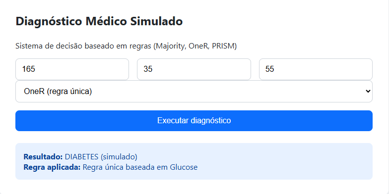
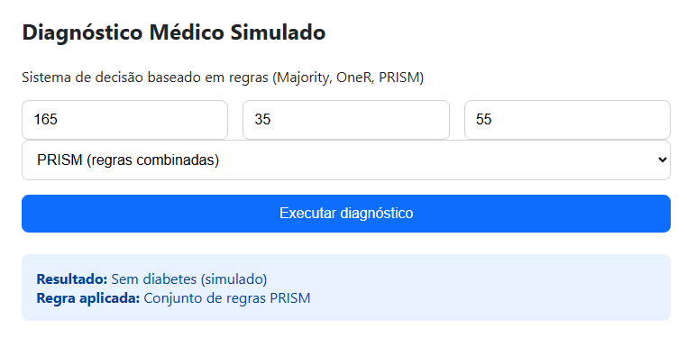

# 🧠 Diagnóstico Médico Baseado em Regras (Medical Rule-Based Diagnosis) – Sistema Especialista Didático

Projeto didático de sistema de decisão baseado em regras utilizando algoritmos clássicos de rule learning: Majority Classifier, OneR e PRISM, com interface web interativa e motor de inferência explicável.

Este projeto NÃO é um sistema médico real. Ele foi desenvolvido exclusivamente para fins educacionais e de portfólio em Ciência de Dados, IA explicável e Engenharia de Sistemas de Decisão.

---

## 📊 Base de Dados

Este sistema utiliza a base pública:
[**Pima Indians Diabetes Database**](https://www.kaggle.com/datasets/uciml/pima-indians-diabetes-database)

A base contém dados reais de pacientes (glicose, IMC, idade, pressão, histórico familiar, etc.) e o diagnóstico verdadeiro (Outcome).

Esses dados são usados apenas para treinamento do motor de regras.

---

## 🎯 Proposta do Projeto

Demonstrar como sistemas de decisão explicáveis podem ser construídos a partir de dados reais utilizando algoritmos de indução de regras.

O objetivo é mostrar, de forma clara, a diferença entre:
- modelos que não aprendem nada
- modelos que aprendem regras simples
- modelos que constroem sistemas especialistas completos

---

## 🧠 Modelos Utilizados

### Majority Classifier

Classificador de baseline.
Ele não aprende padrões — apenas retorna sempre a classe mais comum da base.

Serve para demonstrar que uma boa acurácia pode esconder um modelo completamente inútil clinicamente.

---

### OneR (One Rule)

Algoritmo que testa cada atributo separadamente e escolhe aquele que gera a melhor regra única.

Exemplo de regra aprendida:
> “SE Glucose > 140 → diabetes = 1”

Mostra como uma única variável pode ser altamente informativa.

---

### PRISM

Algoritmo de indução de múltiplas regras combinadas.

Ele constrói regras do tipo:
SE Glucose > 150 E BMI > 30 E Age > 50 → diabetes = 1

Isso cria um sistema especialista real, totalmente explicável, auditável e humano-legível.

---

## ⚙️ Engenharia do Sistema

1. A API carrega o CSV e treina os modelos apenas uma vez no startup.
2. As regras aprendidas ficam em memória.
3. Cada requisição executa apenas inferência por regras (lookup), garantindo respostas instantâneas.

O PRISM exporta automaticamente as regras aprendidas para:  
`reports/rules.txt`  

Esse arquivo é o **manual humano de decisão da IA**.  

---  

## 🖥 Interface Web  

O sistema possui uma interface web interativa construída em HTML + CSS autoral (estilo Bootstrap-like).  

O usuário informa:  
- Glucose  
- BMI  
- Age  

Escolhe o modelo (Majority, OneR ou PRISM) e executa o diagnóstico simulado.  

### Exemplos de uso (prints)  

### 🔹 Majority – Baseline  
  

### 🔹 OneR – Regra Única  
  

### 🔹 PRISM – Regras Combinadas  
  

---  

## ▶️ Como Executar  

Instale dependências:  
`pip install fastapi uvicorn pandas scikit-learn`  

Inicie a aplicação:  
`uvicorn api.app:app --reload`  

Abra no navegador:  
`http://127.0.0.1:8000/ui/`  

---

## ⚠️ Aviso Importante

Este projeto é exclusivamente educacional.
Não deve ser utilizado para diagnósticos médicos reais.

Ele demonstra conceitos de:
- Explainable AI
- Sistemas Especialistas
- Rule Learning
- Engenharia de Inferência

---

## 🧩 Conclusão

Este projeto demonstra na prática como:

• regras podem ser aprendidas automaticamente a partir de dados reais

• sistemas especialistas explicáveis podem ser construídos

• motores de decisão humanos podem ser servidos via API

Transformando dados em regras, e regras em decisões explicáveis.
